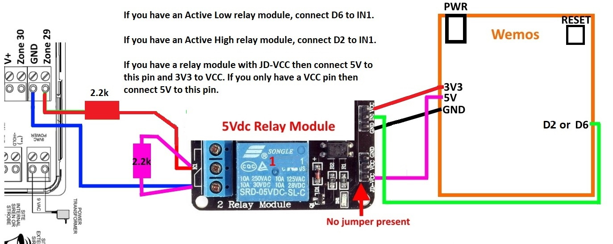

Visonic have not provided a way of triggering the alarm through the serial connection (some bugs mean you can only sound the siren for about 3/5 seconds and I have done a LOT of testing through trial and error to rule out virtually all potential options). Hence if you want to trigger an alarm on the Powermax through this integration then you will need to set up a relay board like the diagram below, and hence the Wemos pretends to be a wired zone of the Powermax (Zone 29 and Zone 30 are normally Wired zones on virtually all panels) and set as a 24h always active panic alarm (or similar).

In order to do this, you just need a few wires from the Wemos to relay board, and a few wires (plus two resistors) to connect to the Powermax. I suggest trying to find a similar 5V relay module with JD-VCC since this one supports 3V3 on the Wemos connection pins (IN1), but also 5V which is needed for the relay - this also includes an optoisolator which will help for preventing damage to the Wemos, and to ensure any voltage spikes remain separate. However ones with VCC only will be fine if they have an Optoisolator (typically these modules will all be active high).

When connected you should be able to go to IP_OF_WEMOS/alarm?method=IO in a web browser and hear the relay click - if you hear it click but in reverse then swap between D2/D6. Once you have got this working in a web browser then you can configure Powermax to use this zone and then configure SmartThings to trigger the alarm this way.
1) For the Powermax, you need to go into installer mode to configure the new zone. I suggest setting the zone (29 or 30) to Fire / 24h Audible / 24h Silent as the key zone types (the 24h options are basically panic buttons) depending on what you want to happen when the relay is triggered. Once this is setup you should be able to visit the above web address and rather than hearing the relay click you should hear the alarm trigger!
2) In the SmartThings App on the Powermax device, click Settings. On this configuration page you should now choose the alarm trigger method and set it to IO. Be aware SmartThings sometimes takes a while to update preferences (after you press save it takes time before the code sees this change), hence you might find that changing the setting to IO has no effect - if this happens you need to wait a few hours for SmartThings to update in the background, and then it should start working.

Any questions or problems, I suggest asking on the SmartThings forum.

